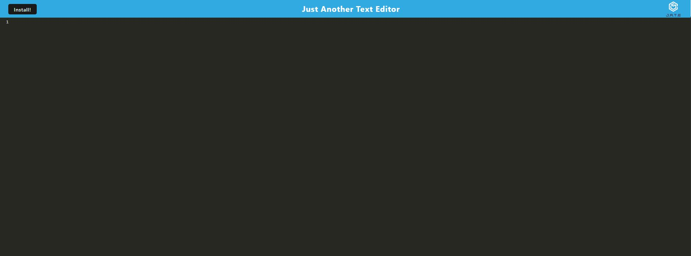

# texteditor

## Description

This application uses webpacks, service workers and other plugins to successfully create a fully functional text editor in the browser

## Installation

1. NPM I
2. NPM RUN BUILD
3. NPM START while connected to the server (to run locally)

## Usage

This application may be used offline while being stored and dowloaded to you local device.

## Deployed Website:
https://floating-fortress-39016.herokuapp.com/

## Screenshot of Website

## Contributors

Jacob Van Dyke

